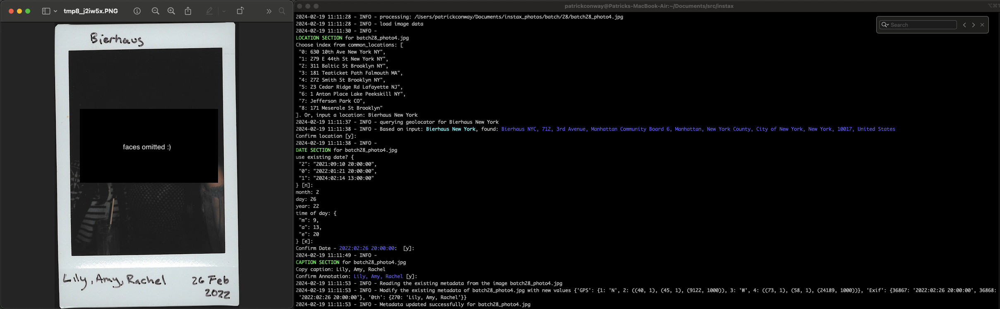

# Image Metadata Editor

This Python script allows you to modify metadata in JPEG images. You can update GPS coordinates, date and time information, and add annotations to your photos.

## Features

- Update GPS coordinates based on location input
- Modify date and time metadata
- Add custom annotations to photos

## Usage
Run the script with the following command:

```shell
python process_photo.py --input_dir <input_dir> --start_offset <start_offset>
```
   
   - `<input_dir>`: Path to the directory containing the JPEG files you want to process.
   - `<start_offset>`: Optional. Specifies the index of the photo to start processing from. Default is 0.
   - `<photo_regex>`: Optional. Specifies the index of the photo to start processing from. Default is matches scan10_photo1

Follow the prompts to update metadata for each photo.

### Example
I've included a demo photo that you can use to test out the program. Run it with:

```shell
cd scripts/photo;
python process_photo.py --input_dir demo/
```



## License

This project is licensed under the MIT License - see the [LICENSE](LICENSE) file for details.

## Acknowledgments

- [Click](https://click.palletsprojects.com/en/8.0.x/): Command line interface creation kit.
- [piexif](https://piexif.readthedocs.io/en/latest/): Python library to simplify working with EXIF data in JPEG files.
- [Pillow](https://python-pillow.org/): Python Imaging Library fork.
- [geopy](https://geopy.readthedocs.io/en/stable/): Geocoding library for Python.